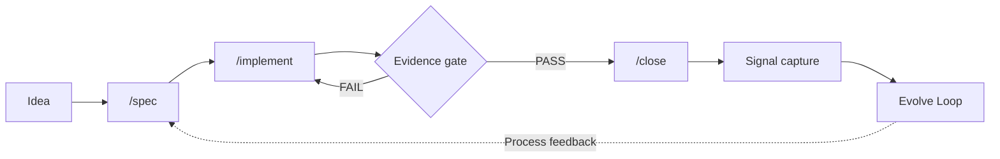

# Concept Overview

FORGE is a project framework that gives AI-assisted development a structured delivery process — spec-driven, evidence-gated, and designed to remain reliable as agent autonomy increases.

> FORGE's mission is to make each individual developer the CEO of a continuously-optimizing development company. FORGE provides strategic advisors, executive staff, and auditable process at every step — but the developer decides exactly what happens, when, and why.

---

## The problem

AI assistants are powerful code generators, but they lose context between sessions, drift from the original goal mid-task, and declare work "done" before it meets acceptance criteria. These failure modes — context decay, goal drift, and premature completion — get worse as tasks grow in scope. Without structure, an operator cannot trust that the AI's output matches the intent.

## Evidence-Gated Iterative Delivery (EGID)

FORGE's underlying methodology is Evidence-Gated Iterative Delivery (EGID). EGID requires that every lifecycle transition — from draft to in-progress, from implementation to closure — passes through an evidence gate: a hard stop that demands demonstrable proof (test output, grep verification, structural checks) before the work moves forward. No assertions. No self-reported status. Evidence or nothing.

## Foundations

EGID draws on five established frameworks — KCS v6's double-loop learning, Stage-Gate's evidence
checkpoints, AAIF's bounded autonomy, Spec Kit's persistent specs, and plugin-primary distribution.
The canonical definition of the five, why each was chosen, and how they interlock lives in
[Design Philosophy § Five Foundations](design-philosophy.md#five-foundations--why-these-five-and-how-they-interlock)
— it is defined once there so the lists cannot drift apart. Beyond the five, FORGE credits
additional influences — Architecture Decision Records (Michael Nygard, 2011) for versioned decision
capture, and Context Anchoring (Rahul Garg, 2026, martinfowler.com) for the living-document pattern
that specs, ADRs, and session logs embody.

## How it works

A change in FORGE follows the Solve Loop: idea to spec to implementation to evidence gate to closure. Signals captured during closure feed the Evolve Loop, which proposes process improvements.

Each step produces or consumes a context anchor. The spec captures intent. The implementation produces evidence. The evidence gate verifies it. The closure captures signals — what went well, what did not, what the process should learn. The Evolve Loop reviews accumulated signals and proposes changes to the process itself.

Change lanes (`hotfix`, `small-change`, `standard-feature`, `process-only`) control the level of ceremony. A one-line fix does not require the same gates as a cross-cutting feature.

## What FORGE does not do

- **Not a project management tool.** FORGE has no Gantt charts, no sprint planning, no velocity tracking. It structures individual changes, not project schedules.
- **Not a certification authority.** FORGE does not issue certifications or guarantee regulatory conformance. It provides process structure, but the operator is responsible for meeting any regulatory requirements.
- **Not an AI model.** FORGE is a set of templates and commands. It works with any AI assistant that reads `AGENTS.md` — it does not provide or require a specific model.
- **Not a replacement for human judgment.** Evidence gates require human review by default. FORGE automates process structure, not decision-making. The operator remains accountable for every closure.

---

## Next steps

- [Team Guide](team-guide.md) — For developers on a team that uses FORGE — what specs are, how to review PRs, and how to contribute without FORGE commands
- [Design Philosophy](design-philosophy.md) — Why FORGE is built the way it is, and what each design decision unlocks for you
- [Getting Started](getting-started.md) — Set up FORGE and run your first spec

---

*Last verified against Spec 263 on 2026-04-15.*
