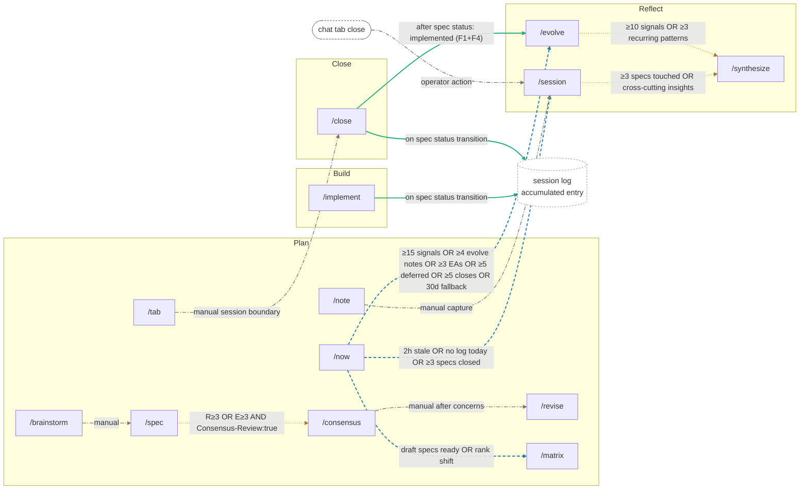

# FORGE Command/Trigger Graph

<!-- Last verified: 2026-04-28 against context-trigger-map.yaml + session-synthesize-evolve-guide.md + close.md → evolve fast-path -->

Anchor: `command-trigger-graph`

A single visual map of the FORGE command surface and the trigger relationships between commands. Hand-drawn from current command bodies, the canonical [session/synthesize/evolve guide](session-synthesize-evolve-guide.md), and `.forge/templates/context-trigger-map.yaml`. Use this when you want to answer "when does X fire Y?" without reverse-engineering text.

Last updated: 2026-04-28 (Spec 357).

---

## Diagram

---

## Reading guide

The four edge classes encode **how** an edge fires, not just **whether** the edge exists.

### 1. Solid green — **auto-fires**

The edge runs without operator confirmation when its trigger condition is met. The classic example is `/close NNN` automatically chaining into `/evolve --spec NNN` (the F1+F4 fast-path) once a spec reaches `implemented` status. You do not approve the chain; FORGE invokes it. Use this class for state-machine transitions where the next step is deterministic and reversible.

### 2. Dashed blue — **auto-prompts via `/now`**

`/now` is FORGE's run-decision aggregator. When an edge is dashed-blue, `/now` evaluates threshold conditions on every invocation and surfaces a recommendation to the operator. The operator runs the suggested command (or doesn't). FORGE never auto-fires these — too much risk of running heavy commands like `/evolve` or `/synthesize` against the operator's intent.

### 3. Dotted orange — **secondary hint**

A command suggests another command at one of its exit points (e.g., `/session` Step 5b suggests `/synthesize` when 3+ specs were touched). The hint surfaces inline in the command's output but does not propagate to `/now` and is not part of the operator's main run-decision flow. Treat dotted-orange edges as "while you're here, consider X."

### 4. Dash-dot grey — **manual-only entry**

Edges between commands that fire only when the operator chooses, with no machine-readable trigger. Examples: closing a chat tab to invoke `/session`; running `/revise` after `/consensus` raises concerns; capturing a thought via `/note` that you later promote at `/session`. These edges live in the operator's head, not in code; the diagram surfaces them so new operators see the wiring.

---

## Cross-reference: where each edge lives

| # | Edge | Source-of-truth file | Line / section |
|---|------|----------------------|----------------|
| 0 | `/close` → `/evolve` (F1+F4 fast-path) | `.claude/commands/close.md` | Step 7+ "Auto-chain to /evolve fast-path" |
| 1 | `/implement` → session log entry | `.claude/commands/implement.md` | Step 0c "Session log stub and incremental entry" |
| 2 | `/close` → session log entry | `.claude/commands/close.md` | Step 8a / structured entry append |
| 3 | `/now` → `/session` (dashed) | `.claude/commands/now.md` | Step 11 staleness prompt |
| 4 | `/now` → `/evolve` (dashed) | `.claude/commands/now.md` | Step 12 evolve threshold check |
| 5 | `/now` → `/matrix` (dashed) | `.claude/commands/now.md` | Backlog drift / rank-shift suggestion |
| 6 | `/session` → `/synthesize` (dotted) | `.claude/commands/session.md` | Step 5b knowledge-consolidation check |
| 7 | `/evolve` → `/synthesize` (dotted) | `.claude/commands/evolve.md` | Step 8.f pattern-analysis consolidation hint |
| 8 | `/spec` → `/consensus` (dotted) | `.claude/commands/spec.md` + `.claude/commands/matrix.md` | Step 12a pre-flight recommendation (Spec 321) |
| 9 | chat tab close → `/session` | one of FORGE's two hard rules | `CLAUDE.md` "Two hard rules" section |
| 10 | `/brainstorm` → `/spec` | `.claude/commands/brainstorm.md` | Idea-promotion exit gate |
| 11 | `/consensus` → `/revise` | `.claude/commands/consensus.md` | Concerns-raised exit path |
| 12 | `/note` → `/session` | `.claude/commands/note.md` + `.claude/commands/session.md` | Scratchpad → session-log promotion at /session Step 5 |
| 13 | `/tab` → `/close` | `.claude/commands/tab.md` | Manual session-boundary closure |

The trigger threshold values for edges 3, 4, 6, 7 live in `.forge/templates/context-trigger-map.yaml` and `docs/process-kit/session-synthesize-evolve-guide.md` (canonical comparison table). When a threshold changes, update both the map and this diagram's edge labels.

---

## Design notes

- **15-node ceiling**: The diagram caps at 15 nodes (13 commands + `chat tab close` + `session log accumulated entry`). The Spec 357 Requirements list two additional external-event nodes (`signal-threshold crossing`, `spec status transition`) which are encoded as **edge labels** rather than standalone nodes to stay under the ceiling. Dashed edges 3-5 are themselves the "signal-threshold crossing" relationships; solid edges 0-2 carry "spec status transition" semantics.
- **Hand-drawn now**: Auto-derivation from command frontmatter + trigger-map YAML is a follow-up spec. If the diagram drifts at two consecutive `/evolve` reviews, file the auto-derivation spec.
- **Last-verified marker**: The `<!-- Last verified: -->` HTML comment at the top follows the Spec 278 freshness convention. `/now` will flag this doc as stale after 180 days.
- **Mermaid rendering**: GitHub renders Mermaid natively. Most markdown previewers (VS Code, Obsidian, Marked) support it. If your viewer does not, the edge text alone in the source-of-truth table above conveys the same information.

---

## Phases — quick reference

- **Plan**: `/brainstorm`, `/spec`, `/consensus`, `/revise`, `/matrix`, `/now`, `/tab`, `/note` — frame the work and decide what to build.
- **Build**: `/implement` — do the work.
- **Close**: `/close` — validate, capture signals, transition spec to closed.
- **Reflect**: `/session`, `/evolve`, `/synthesize` — capture, learn, consolidate.

If you are new to FORGE, the most operator-impactful flow to internalize is: `/spec` → `/implement` → `/close` (which auto-fires the F1+F4 fast-path of `/evolve`) → `/session` (at session end, which is the second of FORGE's two hard rules).
